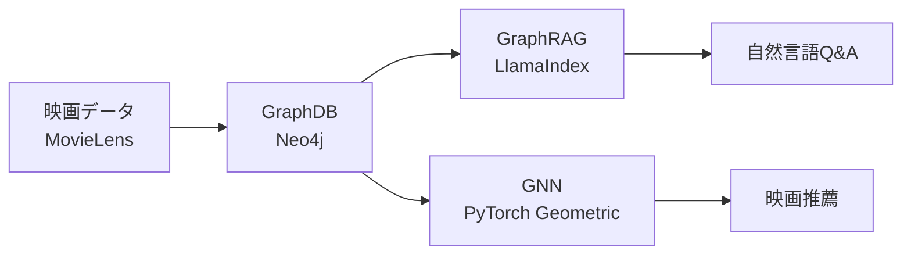

## グラフ＝ノードとエッジの世界

プログラミングで「グラフ」と言うとき、棒グラフや円グラフではなく、**ノード（点）とエッジ（線）で表現されるデータ構造** を指します。

日常にあふれています。

- 地図：交差点（ノード）と道路（エッジ）
- SNS：ユーザー（ノード）とフォロー関係（エッジ）
- 映画データ：映画・俳優・監督（ノード）と出演・監督関係（エッジ）

## ノード・エッジ・プロパティ

```
[映画: "Toy Story"]  --[出演]--> [俳優: "Tom Hanks"]
        |
     [ジャンル: "アニメ"]
```

| 用語 | 意味 | 例 |
|------|------|----|
| **ノード** | グラフ上の点（エンティティ） | 映画、俳優、ユーザー |
| **エッジ** | ノード間の関係 | 出演した、評価した、好きな |
| **プロパティ** | ノード・エッジが持つ属性 | 映画タイトル、評価スコア |

ノードとエッジには **ラベル（種別）** を付けられます。「Movie ノード」「Actor ノード」のように区別します。

## グラフDBとRDBMSの違い

映画「Toy Story」に出演した俳優の、別の出演作を探す例で比較します。

**RDBMSの場合（JOIN が必要）**

```sql
SELECT m2.title
FROM movies m1
JOIN movie_actors ma1 ON m1.id = ma1.movie_id
JOIN actors a ON ma1.actor_id = a.id
JOIN movie_actors ma2 ON a.id = ma2.actor_id
JOIN movies m2 ON ma2.movie_id = m2.id
WHERE m1.title = 'Toy Story'
```

**GraphDBの場合（関係を辿るだけ）**

```cypher
MATCH (m1:Movie {title: "Toy Story"})-[:ACTED_IN]-(a:Actor)-[:ACTED_IN]-(m2:Movie)
RETURN m2.title
```

関係が深くなるほどグラフDBの優位性が増します。3ホップ・4ホップと辿る場合、RDBMSのJOINは指数的に重くなりますが、グラフDBは比較的安定しています。

グラフDBが向くユースケース：

- **推薦システム**（「この映画を見た人はこれも見た」）
- **不正検知**（怪しい取引ネットワークの発見）
- **知識グラフ**（エンティティ間の複雑な関係管理）
- **SNSのフォロワー分析**

## 本書の3技術の位置づけ

本書で扱う3技術は、すべてグラフ構造を活かしますが、役割が異なります。



| 技術 | 入力 | 何をするか | 出力 |
|------|------|-----------|------|
| **GraphDB** | 構造化データ（評価・出演情報） | 保存・検索・関係の探索 | クエリ結果 |
| **GraphRAG** | テキスト（映画の概要） | グラフ化 + LLMで回答生成 | 自然言語の回答 |
| **GNN** | グラフ構造（ユーザー×映画の評価グラフ） | 機械学習でリンクを予測 | おすすめ映画リスト |

次章から環境を整え、順番に体験していきます。
