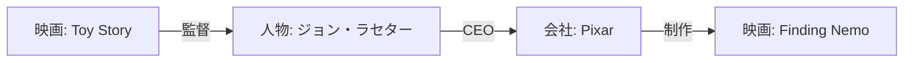

## RAG のおさらい

RAG（Retrieval Augmented Generation）とは、**LLM が回答を生成するときに、外部の文書を検索して文脈として渡す** 手法です。

```
質問 → [文書検索] → 関連チャンク → [LLM] → 回答
```

たとえば「Toy Story の監督は誰ですか？」という質問に対し、映画の説明文を検索して LLM に渡し、回答を生成します。

## 通常 RAG の限界

通常の RAG では文書を「チャンク（断片）」に分割して検索します。

**問題**: チャンク間の **関係が失われる**

例えば：
- チャンク A: 「Toy Story はジョン・ラセターが監督した」
- チャンク B: 「ジョン・ラセターは後にピクサーの CEO になった」
- チャンク C: 「ピクサーは Finding Nemo も制作した」

「Toy Story の監督が関わった別の作品は？」という質問に答えるには、A→B→C という **連鎖した関係** が必要です。チャンク単体の検索では繋がりが見えません。

## GraphRAG の考え方

GraphRAG は文書を **グラフ構造** として保存します。



質問に答えるとき、チャンクを返すのではなく **グラフを辿って関連エンティティと関係を収集** し、それを LLM の文脈として渡します。

関係を跨いだ質問（「Toy Story の監督が関わった別の作品」）に強いのが特徴です。

## 本書での実装方針

| 項目 | 選択 | 理由 |
|------|------|------|
| ライブラリ | LlamaIndex（PropertyGraphIndex） | 設定が少なく、Neo4j と統合しやすい |
| LLM | OpenAI gpt-4o-mini | コストが低く、日本語対応が良好 |
| Embedding | text-embedding-3-small | 高速・低コスト |
| グラフストア | Neo4j（既に起動中） | 前章のデータベースをそのまま活用 |

:::message
**Microsoft GraphRAG との違い**

Microsoft が公開している `graphrag` ライブラリも有名ですが、初期設定が複雑（設定ファイルが多い、コミュニティ構築に時間がかかる）なため本書では扱いません。LlamaIndex の PropertyGraphIndex は同様の概念をシンプルに実装しています。
:::

## 今回使うデータ

`data/movies_overview_sample.csv` には映画50件の概要テキストが入っています。

```
movie_id, title, overview
1, Toy Story (1995), "Led by Woody, Andy's toys live happily..."
2, GoldenEye (1995), "James Bond must unmask the mysterious..."
...
```

次章では、このテキストから LLM を使ってエンティティと関係を抽出し、Neo4j にグラフとして書き込みます。
