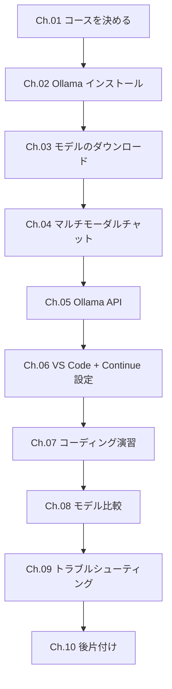
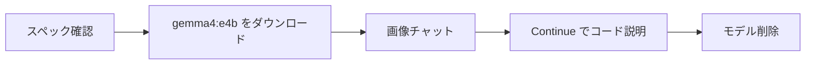

## このハンズオンでできること

1. **マルチモーダルチャット** — 画像・UIスクリーンショット・帳票をローカルLLMに読み取らせる
2. **コーディング支援** — VS Code + Continue からコード説明・リファクタ・テスト生成を試す
3. **モデル比較** — 自分のMacに合ったモデルを選んで速度・品質を体感する

すべてローカル実行です。クラウドAPIキーは不要で、入力データは外部に送信されません。

## 対象読者

| 条件 | 詳細 |
|---|---|
| マシン | MacBook Pro M シリーズ（M1〜M4） |
| macOS | Sonoma 14 以降 |
| スキル | ターミナルでコマンドを実行できる |
| 事前知識 | LLMの利用経験は不要 |

## 本書の構成



## 重要ルール（必ず読んでください）

:::message alert
**1. 全モデルをダウンロードしない**
自分のコースに合うモデルだけ選びます。不要なモデルは数十GBを消費します。

**2. 大型モデルを同時に動かさない**
32GB以下のMacで複数の大型モデルを同時起動すると、動作が極端に重くなります。

**3. 終了後に必ずモデルを削除する**
Ch.10 の手順でモデルを削除し、ストレージを回復してください。
:::

## 時間がない方へ — 15分最短ルート



```bash
# スペック確認
system_profiler SPHardwareDataType | grep "Memory:"
df -h ~

# モデルダウンロード（約9.6GB）
ollama pull gemma4:e4b

# 画像チャット（~/Desktop/sample.png を自分の画像に変える）
ollama run gemma4:e4b ~/Desktop/sample.png "このUIをレビューしてください。"

# 後片付け
ollama rm gemma4:e4b
```

最短ルートを使う場合も、**Ch.01でコースを確認してからCh.03に進む**ことを推奨します。
