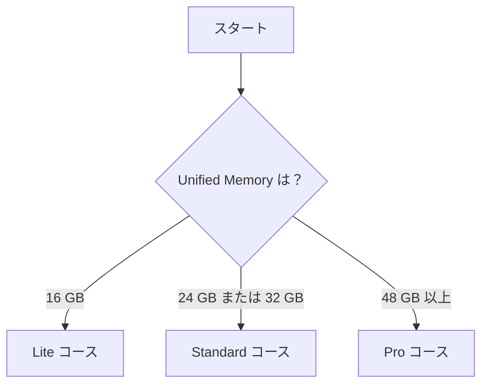

## この章でやること

- MacBook のメモリ（RAM）と空き容量を確認する
- 本書で使う**コース**（Lite / Standard / Pro）を1つ決める
- コース名をメモする（以降の章でずっと使います）

---

## Step 1: スペックを確認する

ターミナルで以下を実行します。

```bash
# Unified Memory（RAM）を確認
system_profiler SPHardwareDataType | grep "Memory:"

# ストレージの空き容量を確認
df -h ~
```

確認する数値は2つだけです。

| 確認項目 | コマンド出力の見方 |
|---|---|
| **Unified Memory** | `Memory: 16 GB` のように表示される |
| **空き容量** | `df -h ~` の `Avail` 列の数値 |

---

## Step 2: コースを選ぶ

**下の表で、あなたのメモリと空き容量に当てはまる行を1つ選んでください。**

| コース名 | Unified Memory | 最小空き容量 | 使用するモデル | ダウンロードサイズ目安 |
|---|---|---|---|---|
| **Lite コース** | 16 GB | 25 GB 以上 | `gemma4:e4b`（きつければ `gemma4:e2b`） | 9.6 GB（e2b は 7.2 GB） |
| **Standard コース** | 24 GB または 32 GB | 40 GB 以上 | `gemma4:e4b`（32 GB で余裕あれば `qwen3.6:27b` も） | 9.6 GB〜26.6 GB |
| **Pro コース** | 48 GB 以上 | 100 GB 以上 | `qwen3.6:27b` + `gemma4:26b`（64 GB は `:31b`） | 35 GB〜37 GB |

:::message alert
**空き容量が不足している場合は先に解放してください。**
モデルは数GB〜数十GBのファイルです。空き容量が最小ラインを下回っている場合は、不要なファイルを削除してから先に進んでください。
:::

### 迷ったときの簡易フロー



---

## Step 3: コースを確定する

:::message
**あなたのコース：[　　　　] コース** ← ここにメモしてください

Lite / Standard / Pro のどれかを書き留めておきます。
次の章から「Standard コースの方は…」という案内が出てきますが、
**コース名が分かれば迷わず自分の手順だけを実行できます。**
:::

---

## Step 4: 使用モデルを確認する

コースごとの使用モデルをまとめます。以降の章でモデル名が出てきたときの対応表として使ってください。

| コース | 基本モデル | 追加モデル（任意） |
|---|---|---|
| Lite | `gemma4:e4b` | `gemma4:e2b`（メモリが足りなければこちらへ） |
| Standard | `gemma4:e4b` | `qwen3.6:27b`（32 GB かつ空き 70 GB 以上の場合のみ） |
| Pro | `qwen3.6:27b` | `gemma4:26b` / `gemma4:31b`（64 GB 以上） |

### モデルの概要

| モデル | 特徴 | 対応機能 |
|---|---|---|
| `gemma4:e2b` | 7.2 GB・軽量 | テキスト・画像 |
| `gemma4:e4b` | 9.6 GB・バランス型 | テキスト・画像 |
| `qwen3.6:27b` | 17 GB・コーディング強め | テキスト・画像・ツール呼び出し |
| `gemma4:26b` | 18 GB・高品質 | テキスト・画像 |
| `gemma4:31b` | 20 GB・最高品質 | テキスト・画像 |

---

## チェックリスト

- [ ] `system_profiler` で Unified Memory を確認した
- [ ] `df -h ~` で空き容量を確認した
- [ ] コースを決めた（Lite / Standard / Pro）
- [ ] コース名をメモした

確認できたら、次章（Ollama のインストール）に進みます。
